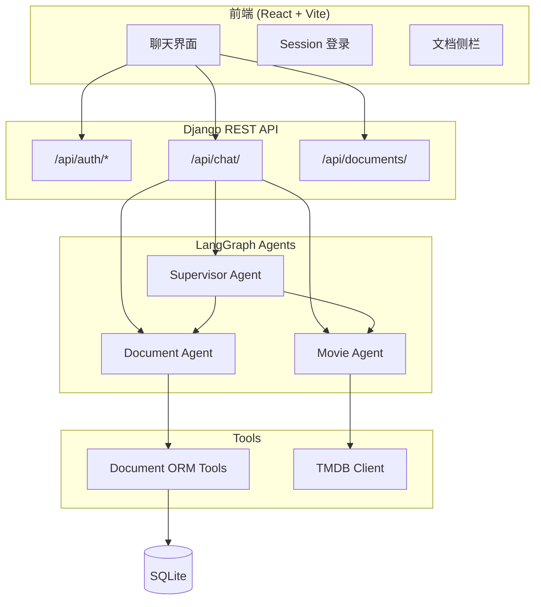

# Django AI Agent

基于 **Django + LangGraph** 的多 Agent 智能助手，支持自然语言驱动的文档管理与电影发现，配套 React 聊天前端。

## 功能特性

- **多 Agent 架构**：Document Agent、Movie Discovery Agent、Supervisor Agent 自动任务分派
- **工具调用（Tool Calling）**：将 Django ORM 封装为 LangChain Tool，实现文档 CRUD
- **电影检索**：集成 TMDB API，支持电影搜索与详情查询
- **多轮对话**：基于 LangGraph Checkpointer + `thread_id` 维持会话上下文
- **用户数据隔离**：文档按 `owner_id` 过滤，用户只能访问自己的数据
- **REST API + 聊天前端**：DRF 提供认证与聊天接口，React 实现交互界面
- **权限探索**：Notebook 中集成 Permit.io RBAC 方案（文档/电影资源）

## 技术栈

| 层级 | 技术 |
|------|------|
| 后端 | Python 3.13 · Django 5.2 · DRF · LangGraph · LangChain |
| 前端 | React 19 · TypeScript · Vite |
| AI | DeepSeek API（OpenAI 兼容接口） |
| 数据 | SQLite · Django ORM |
| 外部 API | TMDB（电影数据）· Permit.io（权限，实验中） |

## 架构



## 项目结构

```
Django-Ai-Agent/
├── src/                    # Django 后端
│   ├── cfehome/            # 项目配置
│   ├── documents/          # 文档 Model
│   ├── ai/                 # Agent、LLM、Tools
│   │   ├── agents.py
│   │   ├── supervisors.py
│   │   └── tools/
│   ├── api/                # REST API
│   └── tmdb/               # TMDB 客户端
├── frontend/               # React 前端
├── notebook/               # Jupyter 教程（1-10）
├── pyproject.toml
└── uv.lock
```

## 快速开始

### 环境要求

- Python >= 3.13
- Node.js >= 18
- [uv](https://github.com/astral-sh/uv)（推荐）

### 1. 配置环境变量

在 `src/.env` 中配置：

```env
DEEPSEEK_API_KEY=your_deepseek_key
TMDB_API_KEY=your_tmdb_key
# 可选
PERMIT_API_KEY=your_permit_key
PERMIT_PDP_URL=https://cloudpdp.api.permit.io
```

### 2. 启动后端

```bash
# 安装依赖
uv sync

# 数据库迁移
cd src
uv run python manage.py migrate

# 创建用户（可选）
uv run python manage.py createsuperuser

# 启动服务
uv run python manage.py runserver 8000
```

### 3. 启动前端

```bash
cd frontend
npm install
npm run dev
```

浏览器访问：**http://localhost:5173**

## API 接口

| 方法 | 路径 | 说明 |
|------|------|------|
| GET | `/api/auth/csrf/` | 获取 CSRF Cookie |
| POST | `/api/auth/login/` | 登录 `{username, password}` |
| POST | `/api/auth/logout/` | 退出 |
| GET | `/api/auth/me/` | 当前用户 |
| POST | `/api/chat/` | 聊天 `{message, agent_type, thread_id?}` |
| GET | `/api/documents/` | 当前用户文档列表 |

**agent_type** 可选值：`document` · `movie` · `supervisor`

**聊天请求示例：**

```json
{
  "message": "列出我最近的文档",
  "agent_type": "supervisor",
  "thread_id": null
}
```

## Notebook 学习路径

| 序号 | 文件 | 内容 |
|------|------|------|
| 1 | `1-hello.ipynb` | 环境验证 |
| 2 | `2-django-user-perms.ipynb` | Django 用户权限 |
| 3 | `3-langgraphd-django-tools-basics.ipynb` | LangGraph Tool 基础 |
| 4 | `4-verfily-llmdjango.ipynb` | LLM 连通性 |
| 5 | `5-helloworld-ai-agent.ipynb` | 第一个 Document Agent |
| 6 | `6-agent-crud.ipynb` | 文档 CRUD Agent |
| 7 | `7-aapi-client-tests.ipynb` | TMDB 客户端 |
| 8 | `8-movie-discovery-agent.ipynb` | 电影发现 Agent |
| 9 | `9-mulit-supervisor.ipynb` | Supervisor 多 Agent |
| 10 | `10-roles-and-permissions.ipynb` | Permit.io RBAC |

## 核心设计

### Agent 调用

```python
from api.agent_service import invoke_agent

result = invoke_agent(
    agent_type="document",
    message="列出我最近的文档",
    user_id=request.user.id,
    thread_id="optional-thread-id",
)
# {"reply": "...", "thread_id": "..."}
```

### 用户隔离

所有文档 Tool 通过 `RunnableConfig` 获取 `user_id`，查询时强制过滤：

```python
Document.objects.filter(owner_id=user_id, active=True)
```

## 后续规划

- [ ] 聊天流式输出（SSE / WebSocket）
- [ ] Permit.io 权限接入 Tool 层
- [ ] 持久化 Checkpointer（Redis / PostgreSQL）
- [ ] Docker 部署

## License

MIT
